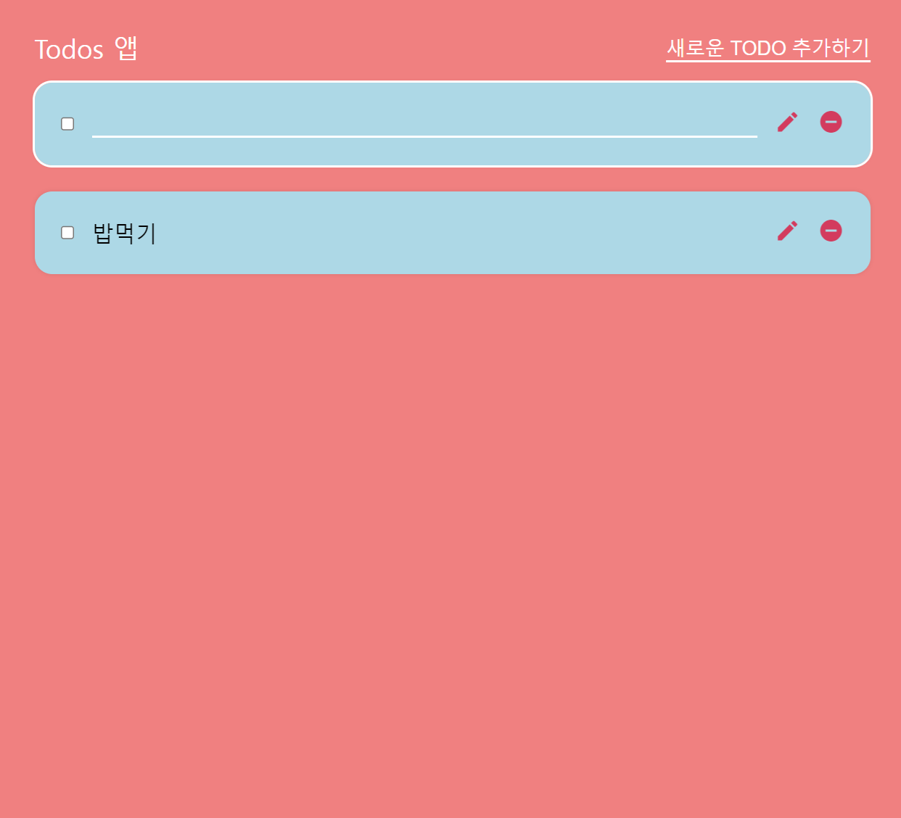

# Todo-Project
할일 목록 및 작업 관리 어플리케이션

## 기능 개선
- blur 뿐 아니라 Enter 키에 의해서도 input 요소에 text가 입력완료되도록 설정
- 모듈화 패턴 적용
    - UIContorller : 요소의 생성과 제거(제어)
    - todoContorller : todo data의 수정과 삭제 등 todo data와 관련된 로직 처리
    - storageController : localStorage에 todo data의 저장 및 load
    - main : 초기화 작업과 주요 이벤트 핸들러의 설정